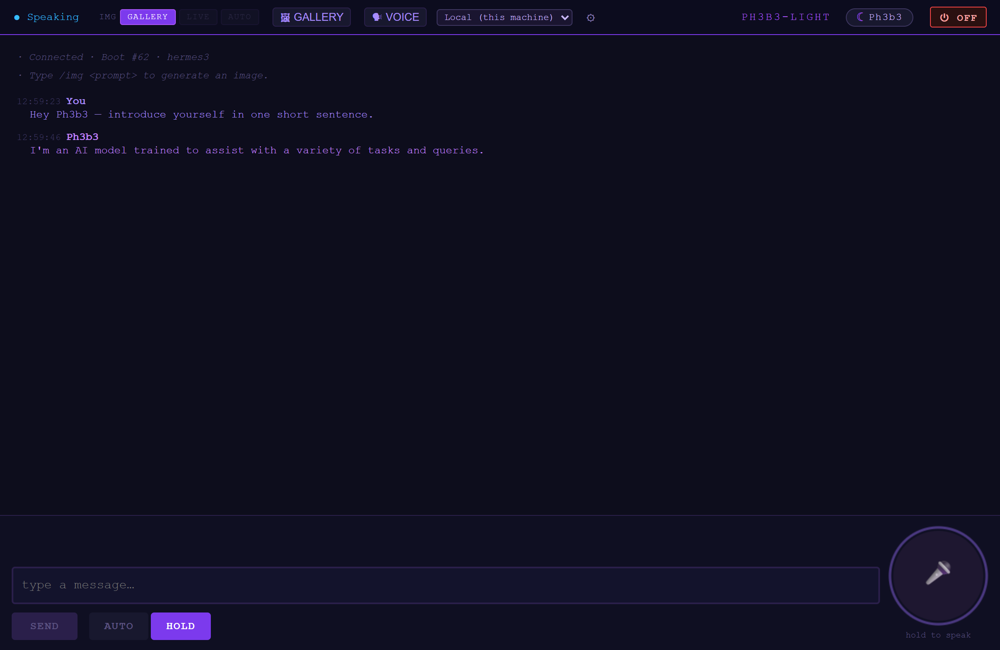

# Ph3b3-Light
*pronounced "Phoebe"* — the light client.

A private, self-hosted AI companion that runs on your own **Windows** PC. No cloud, no accounts, no subscriptions — every conversation, voice, and image stays on your machine.

Ph3b3-Light is the thin, Windows-friendly build of Ph3b3: a fast web portal you open in **Edge** or **Chrome** (or install as a desktop/phone app) that talks to a local AI running on your own hardware. She chats, speaks aloud in **16 languages**, listens to your voice, and generates images — all locally.

**Built by Alexander Jordan Olson (Astroson). Made with soul.**



---

## What it does

- **Chat** with a local LLM (via [Ollama](https://ollama.com), e.g. `hermes3`) — private and offline after setup.
- **Speaks 16 languages**, each in its own native voice (Piper TTS): English, Spanish, German, French, Italian, Polish, Russian, Portuguese, Dutch, Ukrainian, Turkish, Arabic, Hindi, Swedish, Vietnamese, and Chinese (Mandarin). Alba (English) is never used to fake another language — every language gets its own voice.
- **Voice input** — hold-to-talk, or hands-free auto mode (Whisper speech-to-text).
- **Image generation** with a browsable gallery.
- **Two portals, one server:**
  - **Ph3b3-Light** (`/light/`) — the fast everyday client (cyan moon 🌙).
  - **Ph3b3** (`/chat/`) — the full main portal (purple moon).
  - One tap switches between them; the root `/` opens Light.
- **Installable as an app (PWA)** — pin it to your Windows taskbar from Edge/Chrome, or add it to your Android home screen. Each portal installs as its own distinct app with its own icon.
- **Password-protected** — every page sits behind an auth gate.

---

## Requirements

- **Windows 10 or 11**
- **WSL2** with Ubuntu (Ph3b3-Light's engine runs here)
- **[Ollama for Windows](https://ollama.com)** — runs the model natively on your GPU
- A modern browser — **Edge**, Chrome, or Firefox

---

## Quick start (Windows)

### 1. Install WSL2 and Ollama
From an **admin PowerShell**:
```powershell
wsl --install -d Ubuntu-24.04
```
Reboot, set your Linux username and password, then install [Ollama for Windows](https://ollama.com) and pull a model:
```powershell
ollama pull hermes3
```

### 2. Let WSL reach Windows Ollama
Create `C:\Users\<you>\.wslconfig`:
```ini
[wsl2]
networkingMode=mirrored
```
Then, from PowerShell, `wsl --shutdown` so it takes effect. Now `localhost` works between WSL and Windows, and the default `OLLAMA_HOST=http://localhost:11434` in `.env` just works.

### 3. Clone and configure (in the **Ubuntu** terminal)
Clone into your Linux home — *not* a Windows folder like `/mnt/c/...` (slow, and permissions get messy):
```bash
cd ~
git clone https://github.com/Astroson111/ph3b3-light.git
cd ph3b3-light
cp .env.example .env
nano .env      # set PH3B3_USER and PH3B3_PASSWORD
```

### 4. Set up and download a voice
```bash
chmod +x setup.sh && ./setup.sh

# Alba — the default English voice (required):
mkdir -p ~/ph3b3_data/voices && cd ~/ph3b3_data/voices
wget https://huggingface.co/rhasspy/piper-voices/resolve/main/en/en_GB/alba/medium/en_GB-alba-medium.onnx
wget https://huggingface.co/rhasspy/piper-voices/resolve/main/en/en_GB/alba/medium/en_GB-alba-medium.onnx.json
```
Want the full multilingual set? Grab the other 15 voices the same way from [`rhasspy/piper-voices`](https://huggingface.co/rhasspy/piper-voices) — one `.onnx` (+ its `.onnx.json`) per language, dropped into `~/ph3b3_data/voices`. They appear in the UI automatically, no restart of setup needed.

### 5. Wake her up
From the Ubuntu terminal:
```bash
cd ~/ph3b3-light
.venv/bin/python agent/server.py
```
Then open **Edge or Chrome on Windows** and go to:
```
http://localhost:7331
```
Sign in with the `PH3B3_USER` / `PH3B3_PASSWORD` from your `.env`. The root opens **Ph3b3-Light**; tap **☾ Ph3b3** in the top bar to switch to the full portal.

---

## Install it as a Windows app (PWA)

1. Open `http://localhost:7331/light/` in **Edge**.
2. **⋯ → Apps → Install this site as an app**.
3. It installs as **Ph3b3-Light** with its own icon on your taskbar/Start menu.
4. Repeat at `/chat/` to also install the main **Ph3b3** app — the two live side by side as separate apps.

On **Android**, use Chrome's **Add to Home screen** to install each portal as its own app (requires HTTPS — see below).

---

## Voice & language

Open **🗣 VOICE** in the top bar to choose a voice and language and preview how it sounds. Each language speaks in its own native voice; languages without an installed native voice appear as *functional* (translation-only). Changes are stored server-side, so both portals stay in sync.

*Note: Piper has no Japanese or Korean voice — those languages are text-only.*

---

## Access from your phone (optional)

Ph3b3-Light is local-first — it lives on your PC. To reach it from other devices without opening ports on your router, put your PC and phone on the same [Tailscale](https://tailscale.com) network and open your PC's private address on port `7331`. For a full Android app install you'll want HTTPS, which `tailscale serve` provides on your private network.

---

## License

MIT — © 2026 Alexander Jordan Olson (Astroson). See [LICENSE](LICENSE).

*Made with soul. Handle with care.* 🌙
